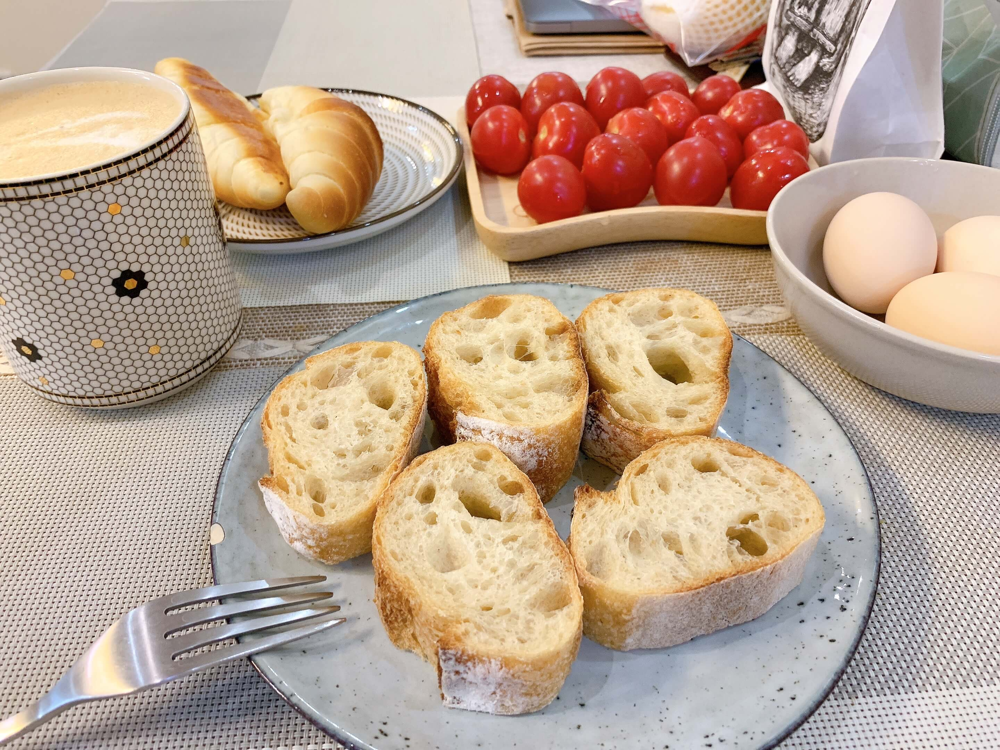

# 法棍

```
#早餐 #适合周末 #麻烦程度5⭐️ #好吃程度3⭐️
```

## 材料

- 面粉    200g    100%
- 盐      4g      2%
- 酵母    0.3g    0.1-0.2%
- 水      140ml   70%

## 步骤

1. 混合水，面团，酵母，盐后盖盖子室温发酵 1 小时；半小时后揉一次面；半小时后再一次揉面
2. 包上保鲜纸，进冰箱过夜。第二天面团发酵两倍大
3. 取出面团四等分，把切面包在里面，放置40分钟回温
4. 把面团按扁后卷起，4 次。中间按下去，搓长。成型
5. 放烘焙纸上，放面团。
6. 最后发酵40分钟
7. 最高温预热烤盘，放小石头。
8. 割刀口
9. 石头倒开水
10. 进烤箱


