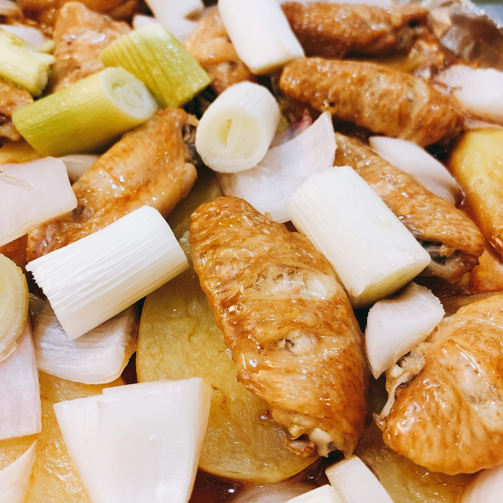

# 烤鸡翅

```
#烤箱 #适合冬天 #麻烦程度5⭐️ #好吃程度5⭐️
```

## 主料

- 鸡翅
- 土豆、洋葱、胡萝卜

## 配料

- 大蒜、酱油、花椒

## 准备步骤

1. 泡水10～15分钟，倒掉血水，滤干水分；
2. 在鸡翅正反面划口子，保证后续入味；
3. 加入葱姜蒜、花椒5克；
4. 倒入老抽上色，生抽、酱油适量，搅拌均匀，放入冰箱隔夜腌制。

## 烹饪步骤

1. 烤箱预热 20 分钟；
2. 烤箱盘，涂上油；
3. 土豆和胡萝卜滚刀切，两面都沾些油，铺在底部；
4. 将腌制好的鸡翅拿出，放在土豆上；
5. 看情况滴些许蜂蜜；
6. 放入切好的洋葱；
7. 用锡纸盖住烤盘；
8. 放入烤箱中，上下加温烤 40 分钟左右；
9. 揭开锡纸，享用美味！


