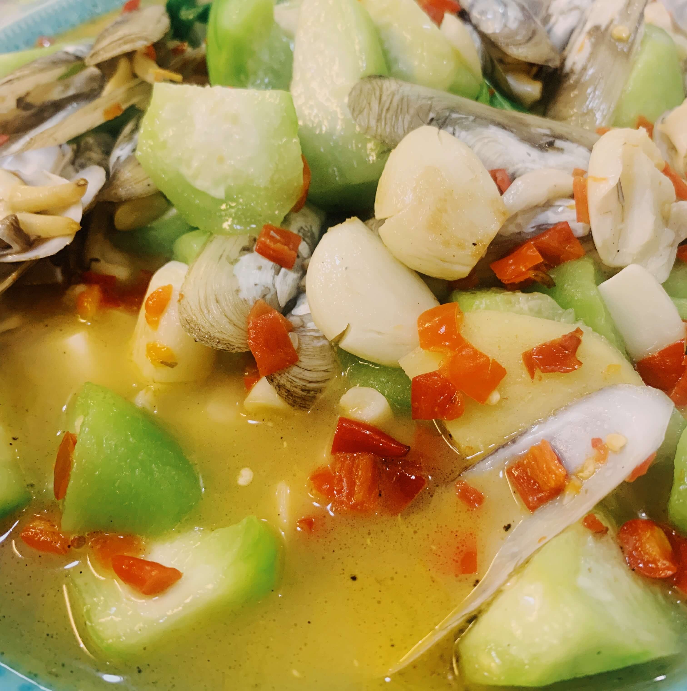

# 爆炒蛏子丝瓜

```
#炒菜 #麻烦程度2⭐️ #好吃程度5⭐️
```

## 材料

- 蛏子、丝瓜

## 配料

- 葱姜蒜、料酒、剁椒酱、辣椒

## 准备步骤

1. 洗净蛏子。丝瓜削皮，滚刀切；
2. 拍大蒜，并切碎；

## 烹饪步骤

1. 热油，放入大蒜；
2. 待锅烧热后，放入蛏子，用锅火熏一下，倒入料酒；（起火啦！）
3. 加入些许水，放入姜片、剁椒酱、辣椒，翻炒一下，盖上锅盖；
4. 待水煮开后，放入丝瓜和葱；
5. 放盐和味精，闷一会儿后起锅。


