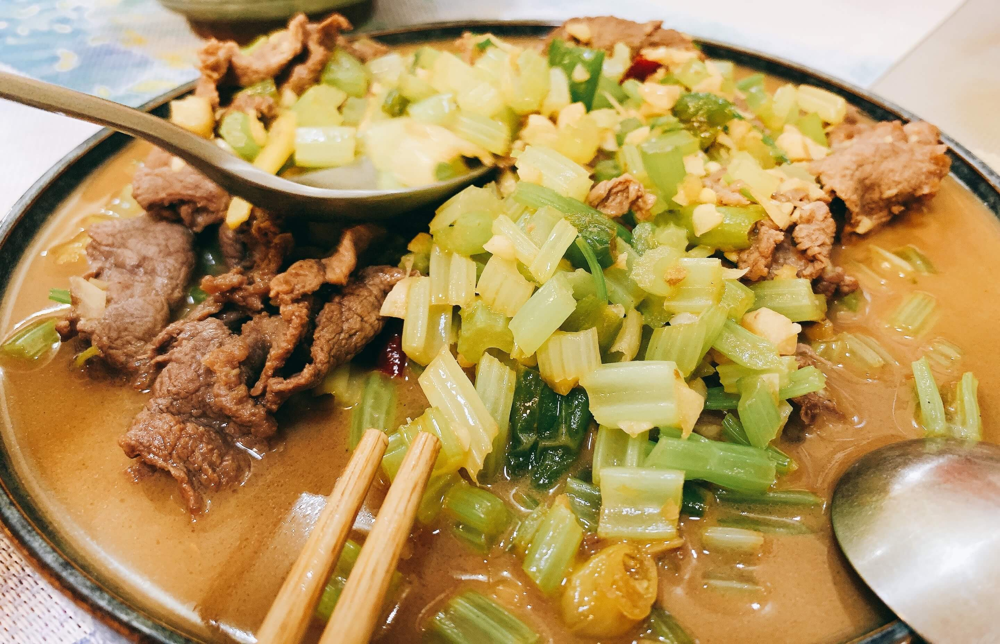

# 芹菜炒牛肉

```
#酸辣口感 #小炒 #很配饭
```

## 主料

- 牛肉
- 芹菜

## 配料

- 生姜、辣椒、泡椒、蒜
- 生抽、老抽、料酒

## 准备步骤

1. 用些许生抽、老抽、蚝油先腌制牛肉十分钟；
2. 芹菜切拇指甲大小的小段；
3. 切蒜末一小勺，姜丝一小份；

## 烹饪步骤

1. 起热锅烧油，放入辣椒和姜丝炸一下油；
2. 放入牛肉、蒜末、泡椒，快速炒30秒左右；
3. 加入芹菜清炒一会儿后，盖上锅盖；
4. 根据情况，在放入些许酱油、料酒、盐、味精；
5. 起锅完成


